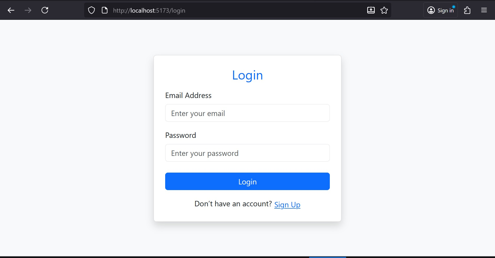

# Task Manager — MERN Stack Project

##  FEATURES INCLUDED

- **Signup** creates a new user by collecting **name**, **email**, and **password**.  
- The password is securely **hashed using bcrypt** and stored in **MongoDB**.  
- Once registered, the user can **log in immediately**.  
- **Login** verifies the user’s credentials and, if valid, **generates a JWT token**.  
- The **JWT token** is stored in **localStorage** for authenticated access.  
- **Task Manager Dashboard** allows users to:  
  - Add new tasks  
  -  Mark tasks as **Done/Not Done**  
  -  Delete tasks  
- Each user can view **only their own tasks** using their authenticated session.  

 **Example Screenshots:**  
**Signup Page**

**Login Page**
  

**Task Manager Dashboard**

